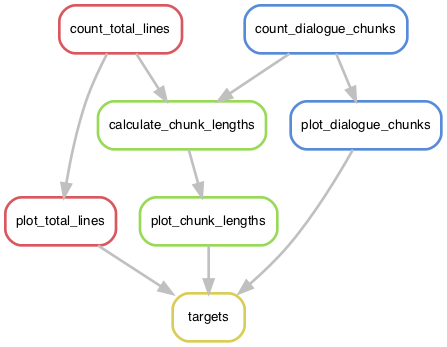

# Snakespeare

<br /><br />
<div align="center">
  
</div>
<br /><br />

Snakespeare is a simple, entertaining, and bioinformatics-free Snakemake workflow designed for first-time workflow users and workflow developers.

The moving parts of Snakespeare are similar to many bioinformatics Snakemake pipelines:
- [`Snakefile`](Snakefile) – contains rules for all steps of workflow
- [`config.yaml`](config.yaml) – parameters users can customize are listed here
- [`environment.yaml`](environment.yaml) – lists software dependencies to be installed into conda virtual environment
- [`scripts/`](scripts) – all Python and R scripts live in this directory
- [`data/`](data) – all input and output files live in this directory


This is an ideal practice pipeline to become familiar with Snakemake before running other workflows or writing a workflow yourself.

## Snakespeare results
This workflow calculates and plots how much different characters speak in Shakespeare's tragedies _Romeo & Juliet_ and _Hamlet_.

<br />
<div align="center">
  
  <p><i>Summary of Snakefile rules.</i></p>
</div>


### Interesting statistics
- **Hamlet** talks the most with over **1428 lines** of iambic pentameter.

- Hamlet's uncle **Claudius** talks the second most with over **500 lines** of iambic pentameter. It must run in the family.

- Besides the Chorus in _Romeo and Juliet_, the **Ghost of King Hamlet** is the most long-winded with an average monologue length of **6.3 lines**.

- **Friar Lawrence** is a close second with an average monologue length of **6.2 lines**.

- **Romeo talks slightly more** than Juliet; however, **Juliet's lines are wittier**.


## Usage

### STEP 1: Install miniconda and git
To run Snakespeare, you will need __git__ and __conda__.

#### Windows users
Windows 10 users will need to install the Ubuntu app from the Windows Store, which give you access to a Unix terminal environment.
- For more info on setting up the Ubuntu app, I recommend [this excellent guide](https://github.com/michaeltreat/Windows-Subsystem-For-Linux-Setup-Guide/blob/master/readmes/02_WSL_Ubuntu_setup.md).
- Next, see [command-line instructions](command_line_install.md) for how to install miniconda in your new Unix terminal.
- You do not need to install git because it should come pre-installed in the Ubuntu app.

#### Mac users
Mac users can install git and miniconda from the following websites:
- Download git: https://git-scm.com/downloads
- Download miniconda: https://docs.conda.io/projects/conda/en/latest/user-guide/install/macos.html

#### Linux users
Linux desktop users can install git and miniconda from the following websites:
- Download git: https://git-scm.com/downloads
- Download miniconda: https://docs.conda.io/projects/conda/en/latest/user-guide/install/linux.html

If you are running Snakespeare on a server without a graphical user interface, see [command-line instructions](server_install.md) for how to install miniconda and git from the terminal.

### STEP 2: Clone the repository

In the terminal, navigate to where you want to download Snakespeare.

Copy and paste these commands to __clone this repository__ and then "change directory" into the folder.
```bash
git clone https://github.com/lisakmalins/Snakespeare.git
cd Snakespeare
```

### STEP 3: Build and activate the conda environment
When you __build the conda environment__, Conda obtains all the software listed in `environment.yaml`. You only need to do this step once.

```bash
conda env create -f environment.yaml
```

Finally, you will need to __activate the environment__. The environment is named "snakespeare," and the software will only be accessible while the environment is active.
```bash
source activate snakespeare
```

When you want to deactivate the environment later, you can do so with the command `conda deactivate`.

### STEP 4: Run Snakespeare
__Run the snakemake workflow__ like this:
```bash
snakemake
```

That's it! The workflow should finish within a few seconds. The plots will appear in the folder `Snakespeare/data/plots/`.
